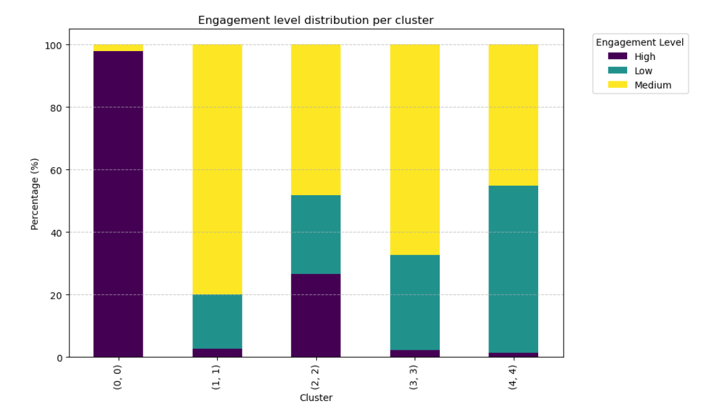

# Gaming Behavior Analysis and Engagement Prediction

This project focuses on clustering user data and analyzing engagement levels to predict which factors influence high engagement in a gaming environment.

## **1. Feature Encoding**

The dataset includes the following features, which have been encoded numerically for clustering analysis:

- **Gender:**
  - Male - 0
  - Female - 1
  
- **Location:**
  - Other - 0
  - Europe - 1
  - Asia - 2
  - USA - 3
  
- **Game Genre:**
  - Sports - 0
  - Action - 1
  - Strategy - 2
  - Simulation - 3
  - RPG - 4
  
- **Game Difficulty:**
  - Easy - 0
  - Medium - 1
  - Hard - 2
  
- **Engagement Level:**
  - Low - 0
  - Medium - 1
  - High - 2
  
- **Age (Discretized in 5-year spans):**
  - 15-19 - 0
  - 20-24 - 1
  - 25-29 - 2
  - 30-34 - 3
  - 35-39 - 4
  - 40-44 - 5
  - 45-49 - 6

- **Player Level (Discretized in 10-year spans):**
  - 0-9 - 0
  - 10-19 - 1
  - 20-29 - 2
  - 30-39 - 3
  - 40-49 - 4
  - 50-59 - 5
  - 60-69 - 6
  - 70-79 - 7
  - 80-89 - 8
  - 90-100 - 9

- **Play Time (Discretized in 4-hour spans):**
  - 0-4 - 0
  - 5-8 - 1
  - 9-12 - 2
  - 13-16 - 3
  - 17-20 - 4
  - 20-24 - 5
  
- **Sessions Per Week (Discretized in 5-session spans):**
  - 0-5 - 0
  - 5-10 - 1
  - 10-15 - 2
  - 15-20 - 3
  
- **Average Session Duration (Discretized in 30-minute spans):**
  - 0-30 - 0
  - 30-60 - 1
  - 60-90 - 2
  - 90-120 - 3
  - 120-150 - 4
  - 150-180 - 5
  
- **Achievements Unlocked (Discretized in 10-achievement spans):**
  - 0-10 - 0
  - 10-20 - 1
  - 20-30 - 2
  - 30-40 - 3
  - 40-50 - 4

---

## **2. Clustering Analysis**

**K-means clustering** was performed on the dataset using the **elbow method** to determine the optimal number of clusters. The elbow method suggested that **5 clusters** would be ideal.

### **Elbow Method**

### **PCA Distribution of Clusters**

---

## **3. Cluster Insights**

After examining the data in the clusters, some interesting patterns were observed, especially regarding engagement levels. For example, **Cluster 0** is primarily composed of **97% high engagement** players, with a small fraction (**3%**) of **medium engagement** players.

### **Engagement Level Distribution by Cluster**

---

## **4. Next Steps: Classification Model**